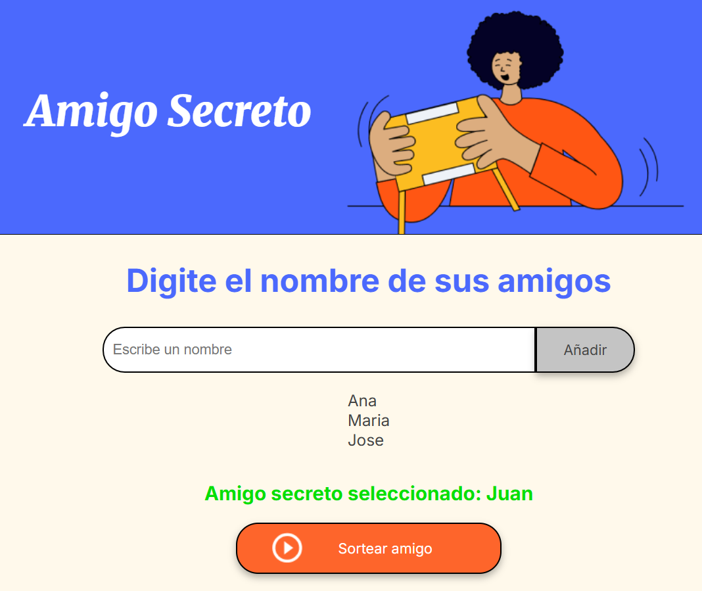

# Proyecto Amigo Secreto

Proyecto del Challenge de Amigo Secreto de Alura Latam del programa Oracle Next Education.  
Este es un pequeño proyecto web que permite ingresar una lista de nombres y luego seleccionar uno al azar.

## Requisitos

Solo necesitas un navegador moderno (Chrome, Firefox, Edge, etc.).

## ¿Cómo usarlo?

1. Escribe los nombres de los participantes en el campo de texto.
2. Haz clic en “Agregar” para añadirlos a la lista.
3. Cuando hayas agregado todos, presiona el botón “Sortear Amigo”.
4. Se seleccionará un amigo al azar de la lista y se mostrará en pantalla.
5. Dicho amigo se removera de la lista.

## Vista previa

## Ejecución

Puedes acceder al proyecto desde:

- [GitHub Pages](https://cesarraulvh.github.io/challenge-amigo-secreto/)
- [Vercel](https://challenge-amigo-secreto-lyart-seven.vercel.app/)